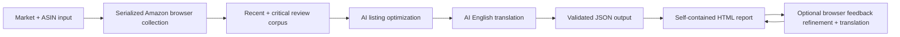

<p align="center">
  
</p>

<h1 align="center">Review Genius 2.0</h1>

<p align="center">
  Turn Amazon listings and customer reviews into copy recommendations designed around official Amazon guidance and conversion best practices, delivered in a self-contained, navigable report.
</p>

<p align="center">
  <strong>TypeScript</strong> · <strong>React</strong> · <strong>DeepSeek or Gemini</strong> · <strong>Amazon marketplace data</strong>
</p>

## What it does

Review Genius processes a list of Amazon ASINs grouped by market and produces an interactive report for reviewing the original listing alongside optimized suggestions. Its shared AI prompt applies official Amazon listing guidance and ecommerce usability research to improve each title, feature set, and description for marketplace alignment, clarity, discoverability, and conversion.

For each product, the tool:

1. Fetches the localized Amazon product page.
2. Extracts the title, feature bullets, description, product image, overall rating, and total review count. It then builds a corpus of up to 30 recent reviews, deliberately adding recent 1–3-star feedback so customer concerns are represented alongside praise.
3. Sends the complete product and review context to the configured AI provider: DeepSeek or Gemini.
4. Generates a market-language title, feature set, and description, plus an English editorial rationale for each suggestion.
5. Makes a separate, faithful translation pass over the original listing, proposed listing, and extracted reviews so an international client can inspect every market in English without weakening the optimization prompt.
6. Builds a self-contained React report with market/product navigation, on-demand English translations, comparisons, character counts, copy controls, review context, and light/dark themes.
7. Lets collaborators regenerate a product's complete suggestion directly in the report with additional keyword, product, or editorial feedback; the new suggestion's English translation is refreshed at the same time.



All build-time external requests are deliberately serialized to avoid parallel request bursts. Because each Amazon collection is followed by AI enrichment before the next product begins, the pipeline is naturally paced without an additional artificial delay. Product pages are cached, while recent review corpora are refreshed after 24 hours. Browser downloads, the dedicated Amazon session, raw review pages, and report downloads all stay under `.cache/`, allowing interrupted runs to resume without polluting the repository.

## Report preview

### Light theme


### Dark theme


## Prerequisites

-   [Git](https://git-scm.com/)
-   [Node.js 22 or newer](https://nodejs.org/) and npm
-   A valid [DeepSeek API key](https://platform.deepseek.com/api_keys) or [Gemini API key](https://aistudio.google.com/app/apikey)
-   Network access to the Amazon marketplaces being processed
-   An interactive desktop session so the visible Amazon browser can be used for sign-in or a CAPTCHA when Amazon requests one

Amazon may block requests originating from datacenter, VPN, or cloud-development IP addresses. Running from a normal domestic connection is recommended if Amazon returns a challenge page. Always use the tool responsibly and respect Amazon's applicable terms and policies.

## Installation

```bash
git clone https://github.com/christycap/review-genius.git
cd review-genius
npm ci
```

Create the local environment file from the committed example:

```bash
cp .env.example .env
```

Configure exactly one provider in `.env`.

For DeepSeek:

```dotenv
DEEPSEEK_API_KEY=your_deepseek_api_key_here
GEMINI_API_KEY=
GEMINI_MODEL=
```

For Gemini, the model is also required:

```dotenv
DEEPSEEK_API_KEY=
GEMINI_API_KEY=your_gemini_api_key_here
GEMINI_MODEL=gemini-3.7-flash
```

The build stops before processing if both keys are set, neither key is set, or Gemini is selected without `GEMINI_MODEL`.

The `.env` file is ignored by Git. Never commit it. The selected provider key is deliberately embedded in the generated HTML so the local browser can regenerate suggestions without a server. Share the report only with collaborators who are allowed to use that key.

## Authenticate with Amazon

Review Genius uses a dedicated persisted browser profile under `.cache/amazon-browser-profile`. It does not copy or unlock cookies from your everyday Chrome profile. Before a large run, open the dedicated session:

```bash
npm run amazon:login
```

One Amazon account page opens for every configured marketplace. Sign in where required, complete any Amazon challenge, then return to the terminal and press Enter. The session is reused by subsequent builds.

You can also start `npm run build` directly. If a review page redirects to sign-in or presents a CAPTCHA, the build keeps its visible browser open, prints the affected market and ASIN, and pauses until you resolve it and press Enter in the terminal. No CAPTCHA is bypassed programmatically.

## Input format

The build reads [`input/Smartbox_2026.json`](input/Smartbox_2026.json). It must contain one object per market and at least one ASIN per object:

The filename also defines the report title. Its extension is removed and underscores or hyphens become spaces, so `Smartbox_2026.json` is displayed as **Smartbox 2026** in the generated website.

```ts
type Market = "fr" | "it" | "es" | "de" | "be" | "nl";

type Input = Array<{
    market: Market;
    asins: string[];
}>;
```

Example:

```json
[
    {
        "market": "fr",
        "asins": ["B07WR8JKKP", "B07WNHC2DP"]
    },
    {
        "market": "it",
        "asins": ["B07X5BWRFB"]
    }
]
```

Input rules:

-   Each market may appear only once.
-   Every ASIN must contain exactly 10 uppercase letters or digits.
-   ASINs must be unique within their market.
-   The enabled `.json` file should contain a conservative test subset before a large run.
-   [`input/Smartbox_2026.json.disabled`](input/Smartbox_2026.json.disabled) contains the full prepared dataset and is ignored by the build until deliberately promoted.

| Market | Amazon store  | Listing language requested  |
| ------ | ------------- | --------------------------- |
| `fr`   | amazon.fr     | French                      |
| `it`   | amazon.it     | Italian                     |
| `es`   | amazon.es     | Spanish                     |
| `de`   | amazon.de     | German                      |
| `be`   | amazon.com.be | Dutch, with French fallback |
| `nl`   | amazon.nl     | Dutch                       |

## Build the dataset and report

```bash
npm run build
```

The command validates the input, resumes completed work, collects missing or stale Amazon data sequentially, requests missing or outdated AI suggestions and English translations, and generates the website. Translation cache metadata covers the exact original copy, proposed copy, and review corpus, so changing any of them refreshes the translation without re-scraping otherwise current Amazon data. Product images are resized and encoded as WebP for the report; intermediate assets and original downloads remain under `.cache/`. Run the build from an interactive terminal so it can pause for operator action if Amazon requests authentication.

The build produces exactly two deliverables:

-   [`output/Smartbox_2026.html`](output/Smartbox_2026.html): a single-file website containing its CSS, JavaScript, favicon, logo, product images, report data, and AI configuration.
-   [`output/Smartbox_2026.json`](output/Smartbox_2026.json): the readable deterministic dataset, also used to resume future builds.

Open the HTML file directly in a browser. No web server or internet connection is required to browse the report or reveal translations; all initial translations are embedded at build time. An internet connection is required only when regenerating suggestions.

On macOS, for example (or double-click the HTML file):

```bash
open output/Smartbox_2026.html
```

### Refine a suggestion in the report

For any product, select **Regenerate suggestions with additional feedback**, enter guidance such as `“idée cadeau voyage” is an important search phrase and must remain in the title`, and submit it. The browser sends the original listing, reviews, current suggestions, and additional feedback to the provider and model selected during the build. The same optimization prompt, structured response format, and deterministic validation are reused. Once the new proposal is validated, a second request translates its title, feature bullets, and description into English.

The refined title, features, description, English rationales, and English translations replace the displayed proposal as one unit. They are saved in that browser's local storage and can be restored to the report's original suggestions from the same panel. Browser refinements do not rewrite `output/Smartbox_2026.json`.

## The optimization prompt

The complete, versioned system prompt is maintained in [`src/prompts/product-optimization.ts`](src/prompts/product-optimization.ts). Keeping it separate makes the editorial policy easy to inspect, review, and evolve independently from the API client.

The prompt is designed around several principles:

-   **Conversion, not congratulations.** The selected model must materially improve every field and may not return an unchanged listing or claim that no work is needed.
-   **Four shopper decisions.** Copy is organized around recognition, relevance, confidence, and desire.
-   **Search intent before arbitrary brevity.** Titles respect Amazon's general 200-character limit. A compact title remains preferable, but source-supported product, occasion, recipient, and long-tail search phrases are retained when their discovery value outweighs a soft display-length preference.
-   **One coordinated listing.** The title, feature list, and description are planned together. Important information moved out of one field must remain in the most useful destination, and each rationale identifies meaningful cross-field moves.
-   **Reviews as prioritization signals.** Up to 30 recent reviews—and deliberate recent 1–3-star coverage—help surface customer vocabulary, valued benefits, uncertainties, and objections. The prompt explicitly treats this as a qualitative corpus rather than a representative rating distribution, and never treats review claims as verified product facts.
-   **No invented claims.** Suggested benefits must follow conservatively from facts already present in the listing.
-   **Language separation.** Suggested listing copy remains in the source market language; concise editorial reasoning is returned in English.
-   **Auditable output.** Each rationale explains its field in the context of the complete proposal, names concrete changes or information movements, and states the expected improvement to discoverability, comprehension, confidence, or conversion.

DeepSeek runs in high-effort thinking mode, while Gemini uses its native structured-output format. Both providers pass through the same deterministic validation, which rejects malformed responses, unchanged fields, titles over the current limit, invalid feature counts, and complacent reasoning. Failed validations are retried before anything is saved.

The provider and model are stored with every generated suggestion. Changing the provider, model, or prompt version invalidates only cached AI suggestions; previously scraped Amazon data remains reusable.

## The translation prompt

English translations use a separate, independently versioned prompt in [`src/prompts/english-translation.ts`](src/prompts/english-translation.ts). Keeping translation out of the optimization request lets the copy model concentrate on market-language search intent, conversion, whole-listing structure, and English reasoning before a focused second pass translates the finished material.

The translation prompt is deliberately conservative: it preserves meaning, sentiment, quantities, product and brand names, feature/review ordering, and empty fields. It explicitly prohibits rewriting, optimizing, summarizing, softening critical reviews, or adding claims. Deterministic validation then verifies the listing feature counts and every review identifier before translations are stored.

Translation prompt version, provider, model, and a hash of the complete translation source are persisted with each product. The report's **Show English translation** controls only reveal that embedded data and never make an API request. A browser refinement is explicitly user-triggered and necessarily translates its newly created suggestion at runtime; both the new copy and its translation are saved together in local storage.
