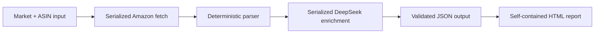

<p align="center">
  
</p>

<h1 align="center">Review Genius 2.0</h1>

<p align="center">
  Turn Amazon listings and customer reviews into copy recommendations designed around official Amazon guidance and conversion best practices, delivered in a self-contained, navigable report.
</p>

<p align="center">
  <strong>TypeScript</strong> · <strong>React</strong> · <strong>DeepSeek</strong> · <strong>Amazon marketplace data</strong>
</p>

## What it does

Review Genius processes a list of Amazon ASINs grouped by market and produces an interactive report for reviewing the original listing alongside optimized suggestions. Its DeepSeek prompt applies official Amazon listing guidance and ecommerce usability research to improve each title, feature set, and description for marketplace alignment, clarity, discoverability, and conversion.

For each product, the tool:

1. Fetches the localized Amazon product page.
2. Extracts the title, feature bullets, description, product image, overall rating, total review count, and a sample of review titles and comments.
3. Sends the complete product and review context to DeepSeek.
4. Generates a market-language title, feature set, and description, plus an English editorial rationale for each suggestion.
5. Builds a self-contained React report with market/product navigation, comparisons, character counts, copy controls, review context, and light/dark themes.



External requests are deliberately serialized to reduce load on Amazon and avoid parallel request bursts. Amazon pages and report assets are cached under `.cache/`, allowing interrupted runs to resume without repeating completed work.

## Report preview

### Light theme


### Dark theme


## Prerequisites

-   [Git](https://git-scm.com/)
-   [Node.js 22 or newer](https://nodejs.org/) and npm
-   A valid [DeepSeek API key](https://platform.deepseek.com/api_keys)
-   Network access to the Amazon marketplaces being processed

Amazon may block requests originating from datacenter, VPN, or cloud-development IP addresses. Running from a normal domestic connection is recommended if Amazon returns a challenge page. Always use the tool responsibly and respect Amazon's applicable terms and policies.

## Installation

```bash
git clone https://github.com/christycap/review-genius.git
cd review-genius
npm ci
```

Create the local environment file from the committed example:

```bash
cp .env.example .env
```

Then replace the placeholder with your DeepSeek token:

```dotenv
DEEPSEEK_API_KEY=your_deepseek_api_key_here
```

The `.env` file is ignored by Git. Never commit or share a real API key.

## Input format

The build reads [`input/Smartbox_2026.json`](input/Smartbox_2026.json). It must contain one object per market and at least one ASIN per object:

The filename also defines the report title. Its extension is removed and underscores or hyphens become spaces, so `Smartbox_2026.json` is displayed as **Smartbox 2026** in the generated website.

```ts
type Market = "fr" | "it" | "es" | "de" | "be" | "nl";

type Input = Array<{
    market: Market;
    asins: string[];
}>;
```

Example:

```json
[
    {
        "market": "fr",
        "asins": ["B07WR8JKKP", "B07WNHC2DP"]
    },
    {
        "market": "it",
        "asins": ["B07X5BWRFB"]
    }
]
```

Input rules:

-   Each market may appear only once.
-   Every ASIN must contain exactly 10 uppercase letters or digits.
-   ASINs must be unique within their market.
-   The enabled `.json` file should contain a conservative test subset before a large run.
-   [`input/Smartbox_2026.json.disabled`](input/Smartbox_2026.json.disabled) contains the full prepared dataset and is ignored by the build until deliberately promoted.

| Market | Amazon store  | Listing language requested  |
| ------ | ------------- | --------------------------- |
| `fr`   | amazon.fr     | French                      |
| `it`   | amazon.it     | Italian                     |
| `es`   | amazon.es     | Spanish                     |
| `de`   | amazon.de     | German                      |
| `be`   | amazon.com.be | Dutch, with French fallback |
| `nl`   | amazon.nl     | Dutch                       |

## Build the dataset and report

```bash
npm run build
```

The command validates the input, resumes any completed work, fetches missing Amazon data, requests missing or outdated DeepSeek suggestions, downloads report assets, and generates the website.

Open [`output/Smartbox_2026/index.html`](output/Smartbox_2026/index.html) directly in a browser. No web server or internet connection is required to browse a completed report.

On macOS, for example (or double click on the index.html):

```bash
open output/Smartbox_2026/index.html
```

The generated `assets/data.json` preserves the deterministic output structure.

## The DeepSeek prompt

The complete, versioned system prompt is maintained in [`src/prompts/product-optimization.ts`](src/prompts/product-optimization.ts). Keeping it separate makes the editorial policy easy to inspect, review, and evolve independently from the API client.

The prompt is designed around several principles:

-   **Conversion, not congratulations.** DeepSeek must materially improve every field and may not return an unchanged listing or claim that no work is needed.
-   **Four shopper decisions.** Copy is organized around recognition, relevance, confidence, and desire.
-   **Amazon-aware structure.** Titles are constrained to 75 characters, while secondary decision details move into three to five scannable feature bullets.
-   **Reviews as prioritization signals.** Review titles and comments help surface customer vocabulary, valued benefits, uncertainties, and objections. They are never treated as verified product facts.
-   **No invented claims.** Suggested benefits must follow conservatively from facts already present in the listing.
-   **Language separation.** Suggested listing copy remains in the source market language; concise editorial reasoning is returned in English.
-   **Auditable output.** Each rationale names the concrete changes and the expected improvement to discoverability, comprehension, confidence, or conversion.

DeepSeek runs in high-effort thinking mode and returns strict JSON. Deterministic validation rejects malformed responses, unchanged fields, titles over the current limit, invalid feature counts, and complacent reasoning. Failed validations are retried before anything is saved.

Changing the prompt version invalidates only cached AI suggestions. Previously scraped Amazon data remains reusable, so a prompt iteration does not require re-requesting every product page.
